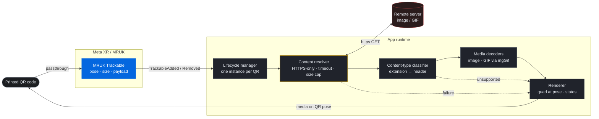

<picture>
  <source media="(prefers-color-scheme: dark)" srcset="Logos/logo-dark.png">
  <source media="(prefers-color-scheme: light)" srcset="Logos/logo-light.png">
  
</picture>

 
 

**Turn any printed QR code into mixed-reality media on Meta Quest 3.**

 

 

[**Usage**](docs/usage.md) ·
[**Build & Deploy**](docs/build-and-deploy.md) ·
[**Architecture**](#architecture) ·
[**Configuration**](docs/configuration.md) ·
[**ADRs**](docs/adr/)

---

QRcodeReader AR is a Meta Quest 3 / 3S **passthrough mixed-reality** app. You see the real world
through passthrough, and when the headset detects a printed **QR code**, the app downloads the media
referenced by the code's URL and renders it — an **image or GIF** — in place of the physical code,
tracked to its real-world pose. Multiple codes are tracked and rendered simultaneously.

> **This is an AR / passthrough MR experience** — the real world stays visible — **not** VR (a fully
> virtual scene). The docs and this README use "AR / passthrough MR" throughout.

## Demo

> 📸 The captures below are **placeholders**. Replace the files in [`docs/media/`](docs/media/) with
> real headset POV screenshots (or a recording) — the layout is already wired up.

| Single QR → image | Multiple QR codes | Animated GIF |
|:---:|:---:|:---:|
|  |  |  |
| One printed code resolves to an image on its pose | Several codes tracked and rendered at once | A code whose URL points at a GIF, playing in place |

## Status

**v1.0.0 — Stable.** The full detect → resolve → classify → decode → render pipeline is
implemented, with multi-QR tracking and teardown, loading/error feedback states, and a finalized
configuration surface. On-device behavior is exercised through documented
[verification procedures](docs/usage.md#4-verify-on-device) (integration, error paths, memory); each
doc keeps a result log of recorded runs.

Delivered feature set:

- ✅ QR detection through Quest passthrough (MRUK Trackables)
- ✅ Runtime `https://` download of the code's payload, behind safety guards
- ✅ **Image and GIF** rendering at the code's real-world pose
- ✅ **Multiple QR codes** tracked and rendered simultaneously
- ✅ Loading and error visual states, with clean teardown on removal

<strong>Development history — milestones M0–M6</strong>

 

Progress was tracked as milestones M0–M6 in the [implementation plan](docs/implementation-plan.md):

| ID | Milestone | Status |
|----|-----------|--------|
| M0 | Foundation & device setup | ✅ Done |
| M1 | QR detection + lifecycle skeleton | ✅ Done |
| M2 | Content resolver + classifier | ✅ Done |
| M3 | Media decoders (image / GIF) | ✅ Done |
| M4 | Renderer + feedback states | ✅ Done |
| M5 | Multi-QR integration & teardown | ✅ Done |
| M6 | Hardening & on-device verification | ✅ Done |

## How it works

For each detected QR code, the app runs a short, sequential pipeline:

1. **Detect** — Meta MRUK reports a QR code with its pose, physical size, and payload string.
2. **Resolve** — the payload is an `https://` URL; the app downloads the bytes under safety guards
   and classifies the content type.
3. **Render** — a flush, coplanar quad is placed at the code's pose (sized from the code and scaled
   by a configurable factor) and the image or GIF is displayed on it.
4. **Track & tear down** — the content follows the code while it's tracked; when the code leaves,
   the content instance is destroyed and its textures are freed.

A loading spinner shows on detect; a shared error icon shows on any failure (bad URL, timeout,
oversized download, network error, or unsupported content type).

## Architecture

The runtime is split into a detection source, a per-QR lifecycle manager, a content resolver
(download + guards), a content-type classifier, media decoders, and a renderer. The untrusted-input
download path is deliberately isolated behind the resolver.

Any stage can short-circuit to the renderer's **error state**. Because there is one content instance
per QR, each code runs its own pipeline — a failure or teardown of one never affects the others.

For component responsibilities, communication, data flow, and constraints, see
[**`docs/architecture.md`**](docs/architecture.md).

## Features & scope

**In scope (v1.0)**

- QR detection through Quest passthrough (MRUK Trackables).
- QR payload is an `https://` URL, downloaded at runtime.
- Render **images and GIFs** at the code's location.
- Track and render **multiple QR codes simultaneously** (one content instance per code).
- Loading and error visual states.

**Out of scope (deferred)**

- Website / non-image-and-GIF content rendering (the "unsupported → error" path is the seam for
  future website support).
- Spatial-anchor persistence / world-locking beyond MRUK's live tracking.
- Texture caching / LRU cache.

Adding any of these requires a new or updated ADR (see [conventions](docs/architecture.md#8-development-conventions)).

## Tech stack

- **Hardware:** Meta Quest 3 / 3S only.
- **Engine:** Unity 6 with the Universal Render Pipeline (URP).
- **XR:** Meta XR SDK (`com.meta.xr.sdk.all`, v203) + MRUK, on OpenXR.
- **Networking:** Unity web request modules (runtime `https` download).
- **GIF decoding:** [mgGif](https://github.com/gwaredd/mgGif) — pinned git dependency in
  `Packages/manifest.json` (`com.gwaredd.mggif`).

## Getting started

> **On-device only.** All QR-detection testing must use **on-device builds**. Play-over-Link has a
> first-run-only QR detection bug — do not rely on it for QR testing.

**Prerequisites**

- Unity 6 with Android build support.
- A Meta Quest 3 / 3S in developer mode, with
  [**installs from unknown sources enabled**](https://www.meta.com/help/quest/291654372573077/)
  (Meta's official guide) so you can sideload the build.
- The Meta XR SDK v203 packages (imported via the Unity Package Manager / `Packages/manifest.json`).

**Build & deploy**

1. Open the project in Unity 6.
2. Ensure the Android build target, URP, and OpenXR are configured (see device setup below).
3. Build an Android APK and deploy it to the headset (on-device — not Link).
4. Launch into passthrough and point the headset at a compliant QR code.

For the detailed, authoritative build-and-deploy loop, see
[**Build & on-device deploy loop**](docs/build-and-deploy.md).

**Required device setup for QR tracking**

- **Spatial Data** permission enabled on the device.
- **Camera Rig + Passthrough Layer** building blocks in the scene.
- **OVRManager:** Scene Support = *Required*, Anchor Support = *Enabled*.
- **MRUK → Tracker Configuration → "QR Code Tracking Enabled"**.

## Authoring a compliant QR code

> For the full end-to-end walkthrough — authoring, config, build/run, and on-device verification —
> see the [**Usage guide**](docs/usage.md).

A QR code's content is a single `https://` URL pointing at an image or GIF. For reliable detection,
the printed code must be:

- QR **version ≤ 10**.
- **Not** a micro-QR code.
- **Not** logo'd / stylised / customised.
- Printed **reasonably large**, and viewed **close and well-lit**.

The URL is treated as **untrusted input**. Downloads are guarded by (all configurable):
**HTTPS-only**, a **10 s timeout**, and a **~25 MB download cap**. These guards plus the render
**scale factor** are authored as Editor assets — see the
[configuration reference](docs/configuration.md) for defaults, limits, and where each value lives.

## Documentation

| Doc | What it covers |
|-----|----------------|
| [Usage guide](docs/usage.md) | End-to-end: author a QR, the config values, build/run on device, and the verification procedures |
| [Project context](docs/project-context.md) | Decisions, scope, requirements, constraints, rejected alternatives |
| [Architecture](docs/architecture.md) | How the system is organized to satisfy those decisions |
| [Build & deploy](docs/build-and-deploy.md) | Build the APK and run it on Quest 3 / 3S; the on-device iteration loop |
| [Configuration](docs/configuration.md) | The four configurable values (HTTPS-only, timeout, download cap, scale factor): defaults, limits, and where they're authored |
| [ADRs](docs/adr/) | [0001 — Meta XR Unity MCP Extension](docs/adr/0001-use-meta-xr-unity-mcp-extension.md) · [0002 — MRUK Trackables for QR](docs/adr/0002-detect-qr-with-mruk-trackables.md) · [0003 — QR payload is a runtime-downloaded URL](docs/adr/0003-qr-payload-is-runtime-downloaded-url.md) |
| [Implementation plan](docs/implementation-plan.md) | Milestones M0–M6, tasks, dependencies, risks |

**Read the docs before proposing changes.** Do not introduce a new technology or architectural
decision without a new ADR (or an update to an existing one) — see
[architecture §8](docs/architecture.md#8-development-conventions).

## Development tooling (Claude Code & MCP)

This project is built with AI-assisted tooling. These are **Editor / authoring-time** aids — none of
them ship on device.

- **[Claude Code](https://claude.com/claude-code)** — the AI development environment. Project
  conventions for AI (and human) contributors live in [`CLAUDE.md`](CLAUDE.md): decisions-before-code,
  the ADR rule, and the git workflow below.
- **Meta XR Unity MCP Extension** (`com.meta.xr.unity-mcp.extension`) — the preferred, authoritative
  tool for Meta-XR **Editor setup**: Camera Rig, passthrough, Android manifest / Spatial Data
  permission, MRUK trackable configuration, and Interaction SDK setup ([ADR 0001](docs/adr/0001-use-meta-xr-unity-mcp-extension.md)).
- **Base Unity MCP** (`com.coplaydev.unity-mcp`) — general Unity Editor automation over MCP
  (GameObjects, scripts, scenes, tests, builds).

## Contributing — git workflow (required)

`dev` is the integration branch; `main` is the stable/release branch. Never commit or push directly
to `dev` or `main`. For **any** change:

1. Create a descriptive branch **off `dev`** (`feat/…`, `fix/…`, `docs/…`, `chore/…`).
2. Commit with a clear message.
3. Push the branch and open a **pull request targeting `dev`** describing what changed and why.
4. **Leave merging the PR to the repo owner** — do not merge, and do not push to `dev` or `main`.

Group related work into one branch/PR; never force-push shared branches, `dev`, or `main`. See
[`CLAUDE.md`](CLAUDE.md) for the authoritative version.

## License

**TBD / internal.** No license has been chosen yet; this project is **not licensed for
distribution**.
